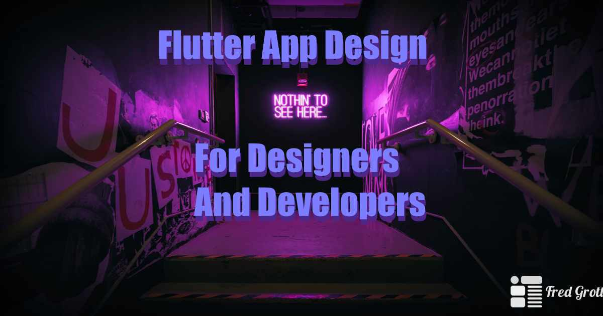

# Flutter App Design For Desgners And Developers

This is the work-in-process source code and demo apps for the book titled, Flutter App Design For Developers And Designers.

A basic beginner book in Flutter App Design with awesome Flutter App Design in-mind.

## Chapter Previews

I am publishing chapter previews at my Medium blog:

[Medium Blog](https://fredgrott.medium.com)

And I posting the Medium Free-For-Friends link to those previews of chapters at these social media sites:

[Instagram](https://www.instagram.com/fredgrott/)
[LinkedIN](https://www.linkedin.com/in/fredgrottstartupfluttermobileappdesigner/)
[Twitter](https://twitter.com/fredgrott)
[Youtube](https://www.youtube.com/c/FredGrott)

## Creation ScreenShots

I publish creation screenshots,etc. at:

[Instagram](https://www.instagram.com/fredgrott/)
[Dibbble](https://dribbble.com/FredGrott)
[BeHance](https://www.behance.net/gwsfredgrott)

## Published At

This book will be published at:

[GumRoad](https://fredgrott.gumroad.com)

## Code License

Code and demo apps is licensed under BSD clause 3, copyright Fredrick Allan Grott.